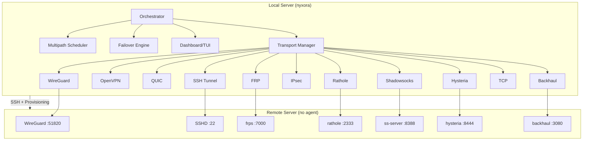

<div align="center">
  
  
  
  
  <a href="https://goreportcard.com/report/github.com/nyxorammd-lgtm/nyxora"></a>
  
  <br>
  <a href="https://github.com/nyxorammd-lgtm/nyxora/actions/workflows/ci.yml"></a>
  <a href="https://github.com/nyxorammd-lgtm/nyxora/actions/workflows/codeql.yml"></a>
  
  
  
  
</div>

<br>

<div align="center">
  <a href="README.md"></a>
  <a href="README.fa.md"></a>
  <a href="README.ru.md"></a>
  <a href="README.zh.md"></a>
  <a href="README.hi.md"></a>
  <a href="README.es.md"></a>
  <a href="README.ar.md"></a>
</div>

<br>

<h1>NYXORA</h1>
  <h3>Stop Testing Tunnels One by One — Use NYXORA</h3>
  <p>
    <b>Self-healing multi-transport VPN/tunnel manager</b><br>
    Install on <i>one</i> server. Connect to <i>any</i> remote server via SSH.<br>
    Zero agent required. Auto-provisions. Auto-failover. Interactive TUI.
  </p>
  <br>
  <p>
    <a href="#-features">Features</a> •
    <a href="#-quick-start">Quick Start</a> •
    <a href="#-one-liner-install">Install</a> •
    <a href="#-usage">Usage</a> •
    <a href="#-architecture">Architecture</a> •
    <a href="#-development">Development</a>
  </p>
</div>

<br>

---

## ✨ Features

<table>
<tr>
<td width="50%">

**🧠 Self-Healing Orchestration**
- 12 tunnel transports: WireGuard, OpenVPN, SSH, QUIC, FRP, Rathole, IPsec, Shadowsocks, Hysteria, Backhaul, TCP, WebSocket
- Automatic failover — detects degraded tunnels, switches instantly
- 5 multipath scheduling modes (weighted, lowest-latency, lowest-loss, even, all-active)
- Real-time scoring engine (latency + packet loss + jitter + stability)

</td>
<td width="50%">

**🚀 Zero-Config Remote**
- No agent or software required on the remote server
- Just SSH access (password or key)
- Auto-detects OS (Ubuntu, Debian, CentOS)
- Auto-installs tunnel binaries on remote

</td>
</tr>
<tr>
<td width="50%">

**🖥️ Rich Terminal UI**
- Interactive Bubble Tea TUI with keyboard navigation
- 3 professional color themes (Catppuccin Mocha, Tokyo Night, Catppuccin Latte)
- Live dashboard with real-time stats
- Animated gradient progress bars
- Boot splash with ASCII art logo
- Tunnel topology view
- Step-by-step connect wizard

</td>
<td width="50%">

**🔐 Enterprise-Grade Security**
- WireGuard VPN at kernel level
- IPsec/strongSwan support
- Shadowsocks encrypted proxy
- Hysteria 2 (modified QUIC with anti-censorship)
- TLS wrapper with self-signed cert generation
- Automatic secret generation (passwords, PSKs, tokens)

</td>
<td width="50%">

**📊 Production-Grade Observability**
- Prometheus metrics endpoint (/metrics)
- Internal DNS resolver with caching
- Rate limiting per transport (token bucket)
- Hot-reload config (file watcher)

</td>
</tr>
</table>

---

## 📦 One-Liner Install

```bash
curl -L github.com/nyxorammd-lgtm/nyxora/releases/download/v0.2.0/nyxora_linux_amd64 -o /usr/local/bin/nyxora && chmod +x /usr/local/bin/nyxora
```

Or using `wget`:

```bash
wget -q https://github.com/nyxorammd-lgtm/nyxora/releases/download/v0.2.0/nyxora_linux_amd64 -O /usr/local/bin/nyxora && chmod +x /usr/local/bin/nyxora
```

<details>
<summary><b>📋 Manual Install (from source)</b></summary>

```bash
# Prerequisites
sudo apt install golang-go git ssh sshpass wireguard curl
# or: brew install go  (macOS)

# Clone
git clone https://github.com/nyxorammd-lgtm/nyxora.git
cd nyxora

# Build
make build

# Install
sudo make install

# Verify
nyxora version
```
</details>

---

## 🚀 Quick Start

```bash
# 1. Setup config & check dependencies
nyxora install

# 2. Connect to a remote server
nyxora connect 192.168.1.100 --user root --password your_password

# 3. Launch interactive TUI
nyxora tui

# 4. Live monitoring dashboard
nyxora dashboard
```

### Connect Options

```bash
nyxora connect <host> [options]

Options:
  --user, -u <name>       SSH username (default: root)
  --port, -p <port>       SSH port (default: 22)
  --password <pass>       SSH password
  --mode <mode>           Server mode: full, lite, minimal
  --transports <list>     Comma-separated transports (overrides mode)
  --ports <pairs>         Port overrides: wg=51820,ss=8388,...
```

#### Server Modes

| Mode     | Transports               | RAM Required |
|----------|--------------------------|--------------|
| `full`   | All 12 tunnels           | 2GB+         |
| `lite`   | Lightweight selection    | 512MB–2GB    |
| `minimal`| SSH + Shadowsocks only   | < 512MB      |

---

## 🎮 Interactive TUI

NYXORA features a full-featured terminal UI built with [Bubble Tea](https://github.com/charmbracelet/bubbletea) and [Lip Gloss](https://github.com/charmbracelet/lipgloss).

```
┌──────────────────────────────────────────────────────────┐
│  NYXORA v0.2.0                                          │
│  ────────────────────────────────────────────────────    │
│                                                          │
│  CPU: 0.5  ████░░░░░░░░░░░░░░░░                        │
│  RAM: 45%  ██████████░░░░░░░░░░                        │
│                                                          │
│  [1] C  Connect to Server                                │
│  [2] D  Dashboard                                        │
│  [3] I  Server Info                                      │
│  [4] N  Install                                          │
│  [5] U  Check for Updates                                │
│  [6] X  Disconnect                                       │
│  [7] T  Tunnel Topology                                  │
│  [8] H  Help                                             │
│  [9] Q  Exit                                             │
│                                                          │
│  ┌────────────────────────────────────────────────────┐  │
│  │  Connect to a remote server                        │  │
│  └────────────────────────────────────────────────────┘  │
│  ↑↓ navigate  ↵ select  1/2/3 theme  s status  ? help   │
│  https://t.me/NyxoraCore                                 │
└──────────────────────────────────────────────────────────┘
```

### Keyboard Shortcuts

| Key       | Action                    |
|-----------|---------------------------|
| `↑` / `↓` | Navigate menu             |
| `Enter`   | Select item               |
| `Esc`     | Go back                   |
| `q`       | Quit / Back to menu       |
| `1`       | Catppuccin Mocha (dark)   |
| `2`       | Tokyo Night (dark)        |
| `3`       | Catppuccin Latte (light)  |
| `s`       | Toggle status bar         |
| `?`       | Open help screen          |
| `t`       | Tunnel topology view      |

---

## 🏗️ Architecture



### Use Cases

| Scenario | Problem | NYXORA Solution |
|----------|---------|----------------|
| **Censorship bypass** | ISP blocks VPN protocols (WireGuard/OpenVPN) | Auto-fails over to Shadowsocks, Hysteria, or QUIC |
| **Unstable network** | High packet loss, frequent disconnects | Continuous scoring, instant failover to best transport |
| **NAT traversal** | Remote server behind NAT, no public IP | FRP/Rathole relay tunnels with reverse connection |
| **Multi-homing** | Multiple ISPs, no load balancing | Multipath scheduler distributes traffic across transports |
| **DevOps automation** | Need programmatic tunnel management | JSON config, environment variables, daemon mode |
| **Low-resource VPS** | 256MB RAM, can't run full VPN stacks | `minimal` mode with SSH + Shadowsocks only |
| **Rapid deployment** | Need tunnels now, no time for manual config | One-command connect with auto-provisioning |

### Alternatives

| Feature | NYXORA | WireGuard | OpenVPN | FRP |
|---------|--------|-----------|---------|-----|
| **Single binary** | ✅ Yes | ❌ Kernel module | ❌ OpenVPN | ✅ |
| **Agentless remote** | ✅ SSH only | ❌ | ❌ | ✅ |
| **Multi-transport** | ✅ 12 transports | ❌ 1 | ❌ 1 | ❌ 1 |
| **Auto-failover** | ✅ Continuous scoring | ❌ | ❌ | ❌ |
| **Interactive TUI** | ✅ Bubble Tea | ❌ | ❌ | ❌ |
| **Self-healing** | ✅ | ❌ | ❌ | ❌ |
| **Anti-censorship** | ✅ Hysteria, SS, QUIC | ❌ Detectable | ❌ Detectable | ❌ |
| **Install on remote** | ✅ Auto | ❌ Manual | ❌ Manual | ❌ Manual |

### Connection Flow

```
nyxora connect 91.107.243.237 --user root --password ...

  1.  PING          → Measure latency & packet loss
  2.  SSH           → Authenticate to remote server
  3.  DETECT OS     → Ubuntu / Debian / CentOS detection
  4.  INSTALL       → Deploy tunnel binaries on remote
  5.  WG KEY        → Generate WireGuard keypair locally
  6.  REMOTE WG     → SSH: config + wg-quick up + iptables
  7.  LOCAL WG      → wg-quick up nyxora0 with remote pubkey
  8.  PROVISION     → Start daemons: frps, rathole, ss, hys, backhaul
  9.  ALL-ACTIVE    → Test & activate all tunnels simultaneously
  10. MONITOR       → Every 10s: ping, score, failover check
```

---

## 📋 Commands

| Command                    | Description                        |
|----------------------------|------------------------------------|
| `nyxora install`           | Setup config & check dependencies  |
| `nyxora connect <host>`    | Connect to remote server           |
| `nyxora disconnect`        | Close all tunnels                  |
| `nyxora status`            | Show connection status             |
| `nyxora dashboard`         | Live terminal dashboard            |
| `nyxora tui`               | Interactive Bubble Tea menu        |
| `nyxora update`            | Check for updates                  |
| `nyxora server`            | Show server info & suggested mode  |
| `nyxora version`           | Show version                       |
| `nyxora daemon`            | Run as background service          |
| `nyxora help`              | Show help                          |

---

## 🔧 Configuration

### Environment Variables

| Variable                    | Description                        | Default            |
|-----------------------------|------------------------------------|--------------------|
| `NYXORA_SS_PASSWORD`        | Shadowsocks password               | auto-generated     |
| `NYXORA_SS_METHOD`          | Shadowsocks cipher                 | `aes-256-gcm`      |
| `NYXORA_RATHOLE_TOKEN`      | Rathole auth token                 | auto-generated     |
| `NYXORA_HYSTERIA_AUTH`      | Hysteria auth password             | auto-generated     |
| `NYXORA_BACKHAUL_TOKEN`     | Backhaul auth token                | auto-generated     |
| `NYXORA_IPSEC_PSK`          | IPsec pre-shared key               | auto-generated     |
| `NYXORA_ALL_ACTIVE`         | Enable all tunnels simultaneously  | `false`            |

### Config File

Config is stored at `/etc/nyxora/config.json` (auto-generated on `nyxora install`).

---

## 📦 Transports

| # | Name          | Port    | Protocol | Category  | Base Score | Weight |
|---|---------------|---------|----------|-----------|------------|--------|
| 1 | **wireguard** | 51820   | UDP      | VPN       | 95         | 30     |
| 2 | **openvpn**   | 1194    | UDP      | VPN       | 75         | 10     |
| 3 | **ssh**       | 22      | TCP      | Tunnel    | 60         | 5      |
| 4 | **quic**      | 9923    | UDP      | Tunnel    | 80         | 15     |
| 5 | **frp**       | 7000    | TCP      | Relay     | 70         | 10     |
| 6 | **rathole**   | 2333    | TCP      | Relay     | 85         | 12     |
| 7 | **ipsec**     | 500     | UDP      | VPN       | 70         | 5      |
| 8 | **shadowsocks**| 8388   | TCP      | Proxy     | 55         | 3      |
| 9 | **hysteria**  | 8444    | UDP      | Tunnel    | 90         | 12     |
| 10| **backhaul**  | 3080    | TCP      | Relay     | 82         | 10     |
| 11| **tcp**       | 9924    | TCP      | Tunnel    | 50         | 3      |
| 12| **websocket** | 9925    | TCP      | Tunnel    | 70         | 8      |

### Multipath Scheduling Modes

| Mode              | Description                                   |
|-------------------|-----------------------------------------------|
| `weighted`        | Distribute traffic based on tunnel weights    |
| `lowest-latency`  | Route all traffic through lowest-latency path |
| `lowest-loss`     | Route all traffic through lowest-loss path    |
| `even`            | Equal distribution across all active tunnels  |
| `all`             | All tunnels active simultaneously             |

---

## 🧑‍💻 Development

### Prerequisites

- Go 1.24+
- Linux or macOS
- `ssh`, `sshpass`, `wg`, `curl`, `ping`

### Setup

```bash
git clone https://github.com/nyxorammd-lgtm/nyxora.git
cd nyxora

# Build
make build

# Run tests
make test

# Vet
make vet

# Run locally
./nyxora version
```

### Project Structure

```
nyxora/
├── cmd/
│   ├── nyxora/           # CLI entrypoint
│   └── quic-server/      # QUIC echo server
├── internal/
│   ├── config/           # Config, secrets, server info, hot-reload watcher
│   ├── dashboard/        # ANSI terminal dashboard
│   ├── dns/              # DNS resolver with caching
│   ├── failover/         # Automatic failover engine
│   ├── interactive/      # Bubble Tea TUI (menu, themes, connect wizard)
│   ├── metrics/          # Prometheus metrics collector & HTTP server
│   ├── monitor/          # Ping-based monitoring
│   ├── multipath/        # Multipath scheduler (5 modes)
│   ├── orchestrator/     # Core engine: connect, monitor, failover
│   ├── packager/         # Tar.gz archive utilities
│   ├── ratelimit/        # Token bucket rate limiter
│   ├── remote/           # SSH client + provisioning
│   ├── routing/          # Scorer + routing engine
│   ├── tls/              # TLS cert manager & wrapper
│   └── transport/        # 12 transport implementations
├── tunnels/              # Install scripts per tunnel
├── Makefile              # Build, test, install, clean
├── Dockerfile            # Multi-stage Docker build
└── install.sh            # One-line installer
```

### Makefile Targets

| Target       | Description                    |
|--------------|--------------------------------|
| `make build` | Build binary                   |
| `make test`  | Run all tests                  |
| `make vet`   | Run go vet                     |
| `make run`   | Build and run                  |
| `make clean` | Remove binary and cache        |
| `make install`| Install to `/usr/local/bin`   |
| `make daemon`| Setup systemd service          |
| `make tunnels`| Package tunnel scripts        |

---

## 🤝 Contributing

> **We love contributions!** Whether you're fixing a typo, reporting a bug, or adding a new transport — every contribution matters. NYXORA is community-driven and we want YOU to be part of it.

**[Read the full Contributing Guide →](CONTRIBUTING.md)**

---

### 🎯 Ways to Contribute

| Type | Difficulty | Description |
|------|------------|-------------|
| 🐛 **Bug Reports** | Easy | Found something broken? Tell us! |
| 📝 **Documentation** | Easy | Fix typos, improve guides, add examples |
| 🧪 **Tests** | Medium | Add test coverage for existing code |
| 🎨 **TUI Improvements** | Medium | Enhance themes, layouts, animations |
| 🔧 **Bug Fixes** | Medium | Fix reported issues |
| 🚀 **New Features** | Hard | Add new commands, modes, options |
| 🌐 **New Transports** | Hard | Implement new tunnel protocols |

**First time contributing?** Look for issues labeled [`good first issue`](https://github.com/nyxorammd-lgtm/nyxora/labels/good%20first%20issue) — they're perfect for getting started!

---

### 🐛 Reporting Bugs

**Before submitting:**
1. Search [existing issues](https://github.com/nyxorammd-lgtm/nyxora/issues) — your bug might already be there
2. Try reproducing on a clean install (fresh `nyxora install`)
3. Update to the latest version (`nyxora update`) — the bug might be fixed already

**How to submit a great bug report:**

1. Click [**New Bug Report**](https://github.com/nyxorammd-lgtm/nyxora/issues/new?template=bug_report.md)
2. Fill in **all sections** (the more detail, the faster we can fix it):

| Section | What to Include |
|---------|-----------------|
| **Describe the Bug** | What happened? What did you expect? |
| **To Reproduce** | Exact commands you ran, step by step |
| **Expected Behavior** | What should have happened instead |
| **Terminal Output** | Copy the FULL error (use ```code blocks```) |
| **Environment** | OS, Go version, NYXORA version, remote server OS |

**📋 Example Bug Report:**

```markdown
**Describe the Bug**
`nyxora connect` fails with "connection refused" when connecting to CentOS 8 server

**To Reproduce**
1. Run `nyxora install`
2. Run `nyxora connect 192.168.1.50 --user root --password mypassword`
3. Error appears at step 5 (INSTALL)

**Expected Behavior**
Tunnel binaries should install successfully on CentOS 8

**Terminal Output**
```bash
[STEP 1] PING: measuring latency...
[STEP 2] SSH: authenticating...
[STEP 3] DETECT OS: CentOS 8 detected
[STEP 4] INSTALL: deploying tunnel binaries...
Error: ssh: connect to host 192.168.1.50 port 22: connection refused
```

**Environment**
- OS (local): Ubuntu 22.04
- Go Version: 1.24.4
- NYXORA Version: 0.2.0
- Remote Server OS: CentOS 8
- RAM: 512MB
```

> **💡 Tip:** Screenshots and terminal recordings help a lot! You can use [asciinema](https://asciinema.org/) for terminal recordings.

---

### 📋 Pull Request Rules

#### 🚀 Quick Start for Contributors

```bash
# 1. Fork & clone
git clone https://github.com/YOUR_USERNAME/nyxora.git
cd nyxora

# 2. Create feature branch
git checkout -b feat/your-feature-name

# 3. Make changes, then test
make test
make vet

# 4. Commit & push
git commit -m "feat: add your feature"
git push origin feat/your-feature-name

# 5. Open PR on GitHub
```

#### 📌 Before You Start

| ✅ Do | ❌ Don't |
|-------|---------|
| Open an issue first for discussion | Submit huge PRs without prior discussion |
| Keep PRs focused (one feature/fix) | Mix multiple features in one PR |
| Write tests for new functionality | Submit code without tests |
| Follow existing code style | Rewrite everything your own way |
| Update documentation | Forget to update README |

#### 🏷️ Branch Naming Convention

| Prefix | When to Use | Example |
|--------|-------------|---------|
| `feat/` | New feature or transport | `feat/add-vless-transport` |
| `fix/` | Bug fix | `fix/failover-race-condition` |
| `docs/` | Documentation only | `docs/update-api-reference` |
| `test/` | Adding tests | `test/add-wireguard-unit-tests` |
| `refactor/` | Code restructuring | `refactor/extract-ssh-client` |
| `hotfix/` | Urgent production fix | `hotfix/crash-on-startup` |

#### ✅ PR Requirements (Must Pass)

Your PR **will not be merged** until these are all green:

| Check | Command | Status |
|-------|---------|--------|
| Tests | `make test` | ✅ All pass |
| Linting | `make vet` | ✅ No warnings |
| Style | See [STYLE_GUIDE.md](STYLE_GUIDE.md) | ✅ Consistent |
| Docs | Updated if behavior changed | ✅ Complete |

#### 📝 PR Description Template

Copy this into your PR description:

```markdown
## 📋 Description
<!-- Briefly describe what this PR does and why -->

## 🔗 Related Issue
<!-- Link the issue this PR fixes -->
Closes #123

## 📝 Type of Change
- [ ] 🐛 Bug fix (non-breaking change that fixes an issue)
- [ ] ✨ New feature (non-breaking change that adds functionality)
- [ ] 💥 Breaking change (fix or feature that would cause existing functionality to change)
- [ ] 📝 Documentation update
- [ ] 🧪 Test update
- [ ] 🔧 Refactor (no functional change)

## 🧪 Testing
<!-- Describe the tests you ran and how to reproduce -->
- [ ] `make test` passes
- [ ] `make vet` passes
- [ ] Manual testing:
  - Tested on: [OS]
  - Tested with: [remote server OS]
  - Steps: [describe]

## 📸 Screenshots / Logs
<!-- If UI change, add screenshots. If bug fix, add before/after logs -->

## ✅ Checklist
- [ ] My code follows the project's style guide
- [ ] I have added tests that prove my fix/feature works
- [ ] All new and existing tests pass
- [ ] I have updated the documentation accordingly
- [ ] I have added an entry to CHANGELOG.md (if applicable)
- [ ] My changes generate no new warnings
- [ ] Any dependent changes have been merged and published

## 💬 Additional Notes
<!-- Any other context about the PR -->
```

#### 💬 Commit Message Convention

We use [Conventional Commits](https://www.conventionalcommits.org/) — this helps us auto-generate changelogs:

| Prefix | When | Example |
|--------|------|---------|
| `feat:` | New feature | `feat: add VLESS transport support` |
| `fix:` | Bug fix | `fix: resolve failover race condition` |
| `docs:` | Documentation | `docs: add Chinese translation` |
| `test:` | Tests | `test: add WireGuard unit tests` |
| `refactor:` | Code cleanup | `refactor: extract SSH client module` |
| `perf:` | Performance | `perf: optimize ping latency calculation` |
| `style:` | Formatting | `style: fix indentation in dashboard.go` |
| `chore:` | Maintenance | `chore: update Go dependencies` |
| `ci:` | CI/CD | `ci: add GitHub Actions workflow` |

**Format:** `<type>: <description>`

**Examples:**
```
feat: add VLESS transport with TLS support
fix: resolve connection timeout on slow networks
docs: update API reference for v0.3.0
test: add integration tests for failover engine
```

#### 👀 Review Process

1. **Automated checks** must pass (CI/CD)
2. **Code review** by at least **1 maintainer**
3. **No merge conflicts** with `main`
4. **Squash and merge** — keeps commit history clean

**What reviewers look for:**
- ✅ Code is clean and follows existing patterns
- ✅ Tests cover new functionality
- ✅ Documentation is updated
- ✅ No breaking changes (or clearly documented)
- ✅ Performance is not degraded

---

### 🏆 Recognition

All contributors are recognized in our [Contributors section](#-contributors). We also:

- Mention contributors in release notes
- Give special recognition for significant contributions
- Welcome new contributors with a warm welcome in PR comments

---

### 💬 Need Help?

- 📖 Read the [Contributing Guide](CONTRIBUTING.md) for detailed instructions
- 💬 Join our [Telegram Channel](https://t.me/NyxoraCore) for questions
- 🐛 Check [existing issues](https://github.com/nyxorammd-lgtm/nyxora/issues) for inspiration
- 📧 Email maintainers for private concerns

> **Remember:** There are no stupid questions! We were all beginners once. Don't hesitate to ask for help.

## 🌟 Contributors

<a href="https://github.com/nyxorammd-lgtm/nyxora/graphs/contributors">
  
</a>

---

## 📄 License

This project is licensed under the **MIT License** — see the [LICENSE](LICENSE) file for details.

---

<div align="center">
  <br>
  <p>
    <a href="https://t.me/NyxoraCore">Telegram Channel</a> •
    <a href="https://github.com/nyxorammd-lgtm/nyxora/issues">Report Bug</a> •
    <a href="https://github.com/nyxorammd-lgtm/nyxora/issues">Feature Request</a>
  </p>
  <p>
    <sub>Built with ❤️ using Go &amp; Bubble Tea</sub>
  </p>
</div>
