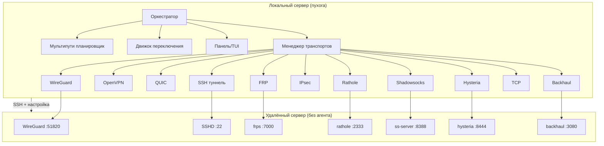

<div align="center">
  
  
  
  
  <br>
  
  
</div>

<br>

<div align="center">
  <a href="README.md"></a>
  <a href="README.fa.md"></a>
  <a href="README.ru.md"></a>
  <a href="README.zh.md"></a>
  <a href="README.hi.md"></a>
  <a href="README.es.md"></a>
  <a href="README.ar.md"></a>
</div>

<br>

<h1>NYXORA</h1>
  <h3>Прекратите тестировать туннели по одному — используйте NYXORA</h3>
  <p>
    <b>Самовосстанавливающийся мульти-транспортный менеджер VPN/туннелей</b><br>
    Установите на <i>одном</i> сервере. Подключайтесь к <i>любому</i> удалённому серверу через SSH.<br>
    Без агента. Автоматическая настройка. Автоматический переключение. Интерактивный TUI.
  </p>
  <br>
  <p>
    <a href="#-возможности">Возможности</a> •
    <a href="#-быстрый-старт">Быстрый старт</a> •
    <a href="#-установка">Установка</a> •
    <a href="#-команды">Команды</a> •
    <a href="#-архитектура">Архитектура</a> •
    <a href="#-разработка">Разработка</a>
  </p>
</div>

<br>

---

## ✨ Возможности

<table>
<tr>
<td width="50%">

**🧠 Самовосстанавливающаяся оркестрация**
- 11 транспортов туннелей: WireGuard, OpenVPN, SSH, QUIC, FRP, Rathole, IPsec, Shadowsocks, Hysteria, Backhaul, TCP
- Автоматическое переключение — обнаружение деградированных туннелей и мгновенный переход
- 5 режимов мультипути (weighted, lowest-latency, lowest-loss, even, all-active)
- Движок оценки в реальном времени (задержка + потеря пакетов + вес)

</td>
<td width="50%">

**🚀 Удалённая настройка без конфигурации**
- Не требует агента или ПО на удалённом сервере
- Только SSH доступ (пароль или ключ)
- Автоопределение ОС (Ubuntu, Debian, CentOS)
- Автоустановка бинарников туннелей на удалённый сервер

</td>
</tr>
<tr>
<td width="50%">

**🖥️ Богатый интерфейс терминала**
- Интерактивный TUI на Bubble Tea с навигацией клавиатурой
- 3 профессиональные цветовые схемы (Catppuccin Mocha, Tokyo Night, Catppuccin Latte)
- Живая панель мониторинга со статистикой в реальном времени
- Анимированные градиентные полосы прогресса
- ASCII логотип на экране загрузки
- Просмотр топологии туннелей
- Пошаговый мастер подключения

</td>
<td width="50%">

**🔐 Безопасность корпоративного уровня**
- VPN WireGuard на уровне ядра
- Поддержка IPsec/strongSwan
- Зашифрованный прокси Shadowsocks
- Hysteria 2 (модифицированный QUIC с анти-цензурой)
- Автогенерация паролей (пароли, PSK, токены)

</td>
</tr>
</table>

---

## 📦 Установка

```bash
curl -fsSL https://raw.githubusercontent.com/nyxorammd-lgtm/nyxora/master/install.sh | sudo bash
```

Или через `wget`:

```bash
wget -qO- https://raw.githubusercontent.com/nyxorammd-lgtm/nyxora/master/install.sh | sudo bash
```

<details>
<summary><b>📋 Ручная установка (из исходников)</b></summary>

```bash
# Зависимости
sudo apt install golang-go git ssh sshpass wireguard curl
# или: brew install go (macOS)

# Клонирование
git clone https://github.com/nyxorammd-lgtm/nyxora.git
cd nyxora

# Сборка
make build

# Установка
sudo make install

# Проверка
nyxora version
```
</details>

---

## 🚀 Быстрый старт

```bash
# 1. Настройка конфигурации и проверка зависимостей
nyxora install

# 2. Подключение к удалённому серверу
nyxora connect 192.168.1.100 --user root --password your_password

# 3. Запуск интерактивного TUI
nyxora tui

# 4. Панель мониторинга в реальном времени
nyxora dashboard
```

### Параметры подключения

```bash
nyxora connect <host> [options]

Параметры:
  --user, -u <name>       Имя пользователя SSH (по умолчанию: root)
  --port, -p <port>       Порт SSH (по умолчанию: 22)
  --password <pass>       Пароль SSH
  --mode <mode>           Режим сервера: full, lite, minimal
  --transports <list>     Список транспортов (заменяет mode)
  --ports <pairs>         Переопределение портов: wg=51820,ss=8388,...
```

#### Режимы сервера

| Режим | Транспорты | Требуемая RAM |
|-------|------------|---------------|
| `full` | Все 11 туннелей | 2GB+ |
| `lite` | Облегчённый набор | 512MB–2GB |
| `minimal` | SSH + Shadowsocks | < 512MB |

---

## 🎮 Интерактивный TUI

NYXORA имеет полноценный интерфейс терминала, созданный на [Bubble Tea](https://github.com/charmbracelet/bubbletea) и [Lip Gloss](https://github.com/charmbracelet/lipgloss).

```
┌──────────────────────────────────────────────────────────┐
│  NYXORA v0.2.0                                          │
│  ────────────────────────────────────────────────────    │
│                                                          │
│  CPU: 0.5  ████░░░░░░░░░░░░░░░░                        │
│  RAM: 45%  ██████████░░░░░░░░░░                        │
│                                                          │
│  [1] C  Подключение к серверу                            │
│  [2] D  Панель мониторинга                               │
│  [3] I  Информация о сервере                             │
│  [4] N  Установка                                        │
│  [5] U  Проверка обновлений                              │
│  [6] X  Отключение                                       │
│  [7] T  Топология туннелей                               │
│  [8] H  Справка                                          │
│  [9] Q  Выход                                            │
│                                                          │
│  ┌────────────────────────────────────────────────────┐  │
│  │  Подключение к удалённому серверу                  │  │
│  └────────────────────────────────────────────────────┘  │
│  ↑↓ навигация  ↵ выбор  1/2/3 тема  s статус  ? помощь  │
│  https://t.me/NyxoraCore                                 │
└──────────────────────────────────────────────────────────┘
```

### Горячие клавиши

| Клавиша | Действие |
|---------|----------|
| `↑` / `↓` | Навигация по меню |
| `Enter` | Выбор |
| `Esc` | Назад |
| `q` | Выход / Назад в меню |
| `1` | Catppuccin Mocha (тёмная) |
| `2` | Tokyo Night (тёмная) |
| `3` | Catppuccin Latte (светлая) |
| `s` | Показать/скрыть панель статуса |
| `?` | Экран справки |
| `t` | Просмотр топологии туннелей |

---

## 🏗️ Архитектура



### Сценарии использования

| Сценарий | Проблема | Решение NYXORA |
|----------|----------|----------------|
| **Обход цензуры** | ISP блокирует VPN протоколы | Автопереход на Shadowsocks, Hysteria или QUIC |
| **Нестабильная сеть** | Высокая потеря пакетов | Непрерывная оценка, мгновенное переключение |
| **NAT traversal** | Сервер за NAT, нет публичного IP | FRP/Rathole туннели с обратным подключением |
| **Multi-homing** | Несколько ISP, нет балансировки | Мультипути распределение трафика |
| **DevOps автоматизация** | Нужно программное управление | JSON конфиг, переменные окружения |
| **Малоресурсный VPS** | 256MB RAM | Режим `minimal` с SSH + Shadowsocks |
| **Быстрое развёртывание** | Нужны туннели сейчас | Однокомандное подключение |

### Сравнение с альтернативами

| Функция | NYXORA | WireGuard | OpenVPN | FRP |
|---------|--------|-----------|---------|-----|
| **Один бинарник** | ✅ Да | ❌ Модуль ядра | ❌ OpenVPN | ✅ |
| **Без агента** | ✅ Только SSH | ❌ | ❌ | ✅ |
| **Мульти-транспорт** | ✅ 11 транспортов | ❌ 1 | ❌ 1 | ❌ 1 |
| **Автопереключение** | ✅ Непрерывная оценка | ❌ | ❌ | ❌ |
| **Интерактивный TUI** | ✅ Bubble Tea | ❌ | ❌ | ❌ |
| **Самовосстановление** | ✅ | ❌ | ❌ | ❌ |
| **Анти-цензура** | ✅ Hysteria, SS, QUIC | ❌ Обнаруживается | ❌ Обнаруживается | ❌ |
| **Установка на удалённый** | ✅ Авто | ❌ Вручную | ❌ Вручную | ❌ Вручную |

---

## 📋 Команды

| Команда | Описание |
|---------|----------|
| `nyxora install` | Настройка конфигурации и проверка зависимостей |
| `nyxora connect <host>` | Подключение к удалённому серверу |
| `nyxora disconnect` | Закрытие всех туннелей |
| `nyxora status` | Показать статус подключения |
| `nyxora dashboard` | Живая панель терминала |
| `nyxora tui` | Интерактивное меню Bubble Tea |
| `nyxora update` | Проверка обновлений |
| `nyxora server` | Информация о сервере и рекомендуемый режим |
| `nyxora version` | Показать версию |
| `nyxora daemon` | Запуск как фоновый сервис |
| `nyxora help` | Справка |

---

## 🔧 Конфигурация

### Переменные окружения

| Переменная | Описание | По умолчанию |
|------------|----------|--------------|
| `NYXORA_SS_PASSWORD` | Пароль Shadowsocks | Автогенерация |
| `NYXORA_SS_METHOD` | Шифр Shadowsocks | `aes-256-gcm` |
| `NYXORA_RATHOLE_TOKEN` | Токен Rathole | Автогенерация |
| `NYXORA_HYSTERIA_AUTH` | Пароль Hysteria | Автогенерация |
| `NYXORA_BACKHAUL_TOKEN` | Токен Backhaul | Автогенерация |
| `NYXORA_IPSEC_PSK` | Предраспределённый ключ IPsec | Автогенерация |
| `NYXORA_ALL_ACTIVE` | Одновременная активация всех туннелей | `false` |

### Файл конфигурации

Конфигурация хранится в `/etc/nyxora/config.json` (автогенерируется при `nyxora install`).

---

## 📦 Транспорты

| # | Название | Порт | Протокол | Категория | Базовая оценка | Вес |
|---|----------|------|----------|-----------|----------------|-----|
| 1 | **wireguard** | 51820 | UDP | VPN | 95 | 30 |
| 2 | **openvpn** | 1194 | UDP | VPN | 75 | 10 |
| 3 | **ssh** | 22 | TCP | Туннель | 60 | 5 |
| 4 | **quic** | 9923 | UDP | Туннель | 80 | 15 |
| 5 | **frp** | 7000 | TCP | Реле | 70 | 10 |
| 6 | **rathole** | 2333 | TCP | Реле | 85 | 12 |
| 7 | **ipsec** | 500 | UDP | VPN | 70 | 5 |
| 8 | **shadowsocks** | 8388 | TCP | Прокси | 55 | 3 |
| 9 | **hysteria** | 8444 | UDP | Туннель | 90 | 12 |
| 10| **backhaul** | 3080 | TCP | Реле | 82 | 10 |
| 11| **tcp** | 9924 | TCP | Туннель | 50 | 3 |

### Режимы мультипути

| Режим | Описание |
|-------|----------|
| `weighted` | Распределение трафика по весам туннелей |
| `lowest-latency` | Маршрутизация через путь с минимальной задержкой |
| `lowest-loss` | Маршрутизация через путь с минимальными потерями |
| `even` | Равномерное распределение по всем активным туннелям |
| `all` | Все туннели активны одновременно |

---

## 🧑‍💻 Разработка

### Зависимости

- Go 1.25+
- Linux или macOS
- `ssh`, `sshpass`, `wg`, `curl`, `ping`

### Настройка

```bash
git clone https://github.com/nyxorammd-lgtm/nyxora.git
cd nyxora

# Сборка
make build

# Тесты
make test

# Проверка
make vet

# Запуск
./nyxora version
```

### Структура проекта

```
nyxora/
├── cmd/
│   ├── nyxora/           # Точка входа CLI
│   └── quic-server/      # QUIC сервер
├── internal/
│   ├── config/           # Конфигурация, ключи, информация о сервере
│   ├── dashboard/        # Панель терминала ANSI
│   ├── failover/         # Движок автоматического переключения
│   ├── interactive/      # TUI на Bubble Tea
│   ├── monitor/          # Мониторинг пингом
│   ├── multipath/        # Мультипути планировщик
│   ├── orchestrator/     # Основной движок
│   ├── packager/         # Утилиты упаковки
│   ├── remote/           # SSH клиент
│   ├── routing/          # Движок оценки
│   └── transport/        # 11 транспортов
├── tunnels/              # Скрипты установки туннелей
├── Makefile              # Сборка, тесты, установка
├── Dockerfile            # Docker сборка
└── install.sh            # Однострочная установка
```

### Цели Makefile

| Цель | Описание |
|------|----------|
| `make build` | Сборка бинарника |
| `make test` | Запуск тестов |
| `make vet` | Запуск go vet |
| `make run` | Сборка и запуск |
| `make clean` | Удаление бинарника и кеша |
| `make install` | Установка в `/usr/local/bin` |
| `make daemon` | Настройка сервиса systemd |
| `make tunnels` | Упаковка скриптов туннелей |

---

## 🤝 Участие

Мы приветствуем участие! Пожалуйста, прочитайте [Руководство по участию](CONTRIBUTING.md).

**Способы участия:**
- Сообщайте об ошибках через [GitHub Issues](https://github.com/nyxorammd-lgtm/nyxora/issues)
- Предлагайте новые типы транспортов
- Улучшайте TUI / панель мониторинга
- Добавляйте поддержку других ОС
- Пишите тесты и документацию
- Отправляйте PR для открытых Issues

---

## 📄 Лицензия

Этот проект распространяется под лицензией **MIT** — подробности в файле [LICENSE](LICENSE).

---

<div align="center">
  <br>
  <p>
    <a href="https://t.me/NyxoraCore">Telegram Канал</a> •
    <a href="https://github.com/nyxorammd-lgtm/nyxora/issues">Сообщить об ошибке</a> •
    <a href="https://github.com/nyxorammd-lgtm/nyxora/issues">Предложить функцию</a>
  </p>
  <p>
    <sub>Сделано с ❤️ на Go &amp; Bubble Tea</sub>
  </p>
</div>