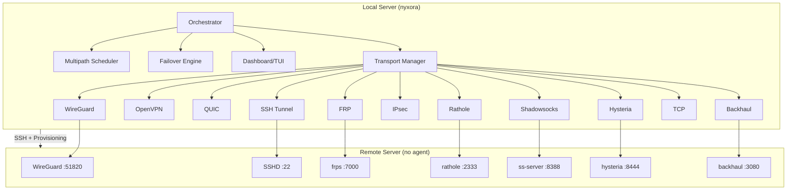
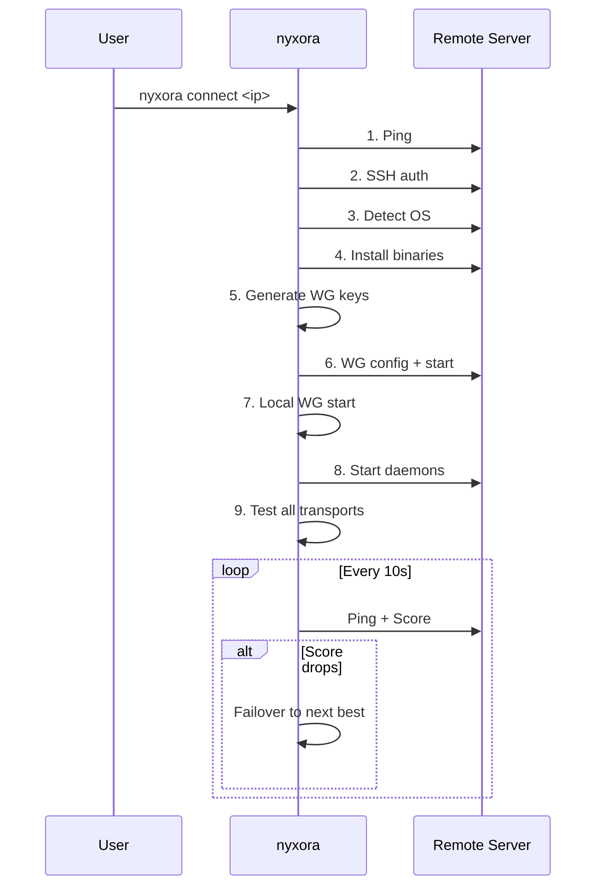

# Architecture

```mermaid
graph TB
    subgraph Local["Local Server (nyxora)"]
        O[Orchestrator] --> T[Transport Manager]
        O --> M[Multipath Scheduler]
        O --> F[Failover Engine]
        O --> D[Dashboard/TUI]
        T --> WG[WireGuard]
        T --> SSH[SSH Tunnel]
        T --> OV[OpenVPN]
        T --> QU[QUIC]
        T --> FR[FRP]
        T --> RA[Rathole]
        T --> IP[IPsec]
        T --> SS[Shadowsocks]
        T --> HY[Hysteria]
        T --> BA[Backhaul]
        T --> TC[TCP]
    end

    subgraph Remote["Remote Server (no agent)"]
        RWG[WireGuard :51820]
        RSSH[SSHD :22]
        RFR[frps :7000]
        RRA[rathole :2333]
        RSS[ss-server :8388]
        RHY[hysteria :8444]
        RBA[backhaul :3080]
    end

    Local -->|SSH + Provisioning| Remote
    WG --> RWG
    SSH --> RSSH
    FR --> RFR
    RA --> RRA
    SS --> RSS
    HY --> RHY
    BA --> RBA
```

## Flow

```mermaid
sequenceDiagram
    participant U as User
    participant N as nyxora
    participant R as Remote Server

    U->>N: nyxora connect <ip>
    N->>R: 1. Ping
    N->>R: 2. SSH auth
    N->>R: 3. Detect OS
    N->>R: 4. Install binaries
    N->>N: 5. Generate WG keys
    N->>R: 6. WG config + start
    N->>N: 7. Local WG start
    N->>R: 8. Start daemons
    N->>N: 9. Test all transports
    loop Every 10s
        N->>R: Ping + Score
        alt Score drops
            N->>N: Failover to next best
        end
    end
```
